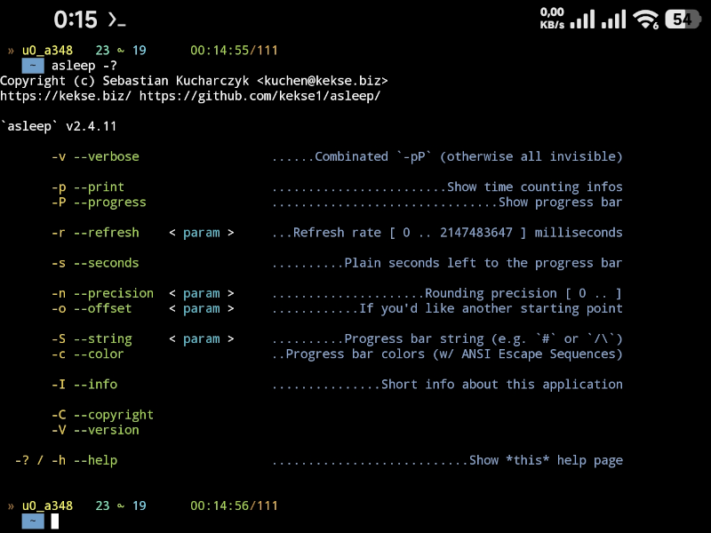
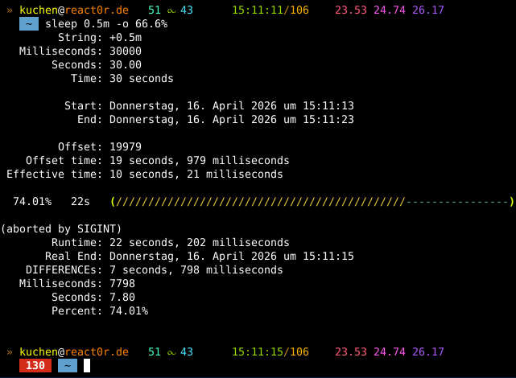
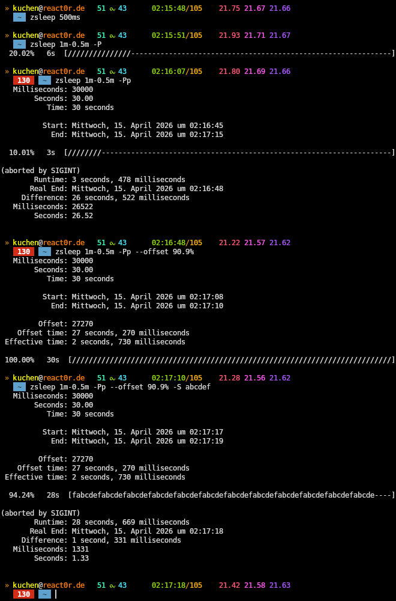
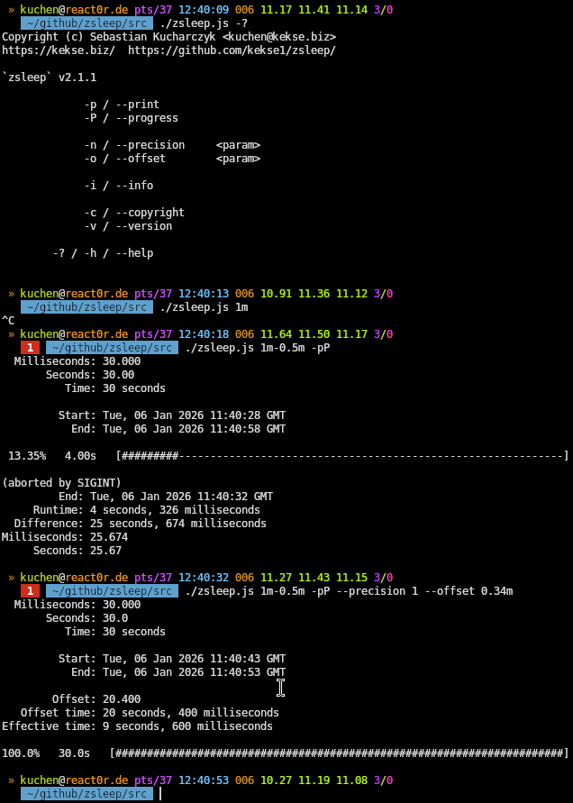

# **a**sleep

My own, better `sleep` replacement (see `man 1 sleep`).

 

Pure **Vanilla** JavaScript - with**out** any dependency (except the
[Node.js](https://nodejs.org/) JavaScript interpreter).

  

## Index
* [News](#news)
* [Example Screenshots](#example-screenshots)
* [Download / Source Code](#download--source-code)
* [Usage](#usage)
    * [Units](#units)
* [Installation](#installation)
* [Exports and Extensions](#exports-and-extensions)
    * [My really tiny `getopt` interpretation](#my-really-tiny-getopt-interpretation)
* [You're welcome!](#youre-welcome)
* [Contact](#contact)
* [Copyright and License](#copyright-and-license)

   

## News
* \[**2026-06-17**\] Fixed a tiny bug in my integrated `getopt` module, v**2.4.14**;
* \[**2026-05-14**\] Just discovered `Math.trunc()`, replacing my old `Math.int()`; v**2.4.13**.
* \[**2026-04-23**\] Removed the **weeks** from my time calculation, v**2.4.12**;
* \[**2026-04-16**\] My tiny `getopt` is fixed, and more details, v**2.4.11**;
* \[**2026-04-16**\] Last changes (and more colors), v**2.4.9**;
* \[**2026-04-15**\] Now w/ `-c / --color` parameter support (for the progress bar), v**2.4.6**;
* \[**2026-04-15**\] Last changes.. should be bug-less (and better) now, v**2.4.4**;
* \[**2026-04-15**\] New minor update(s) (w/ many good improvements);
* \[**2026-04-15**\] See `DEFAULT_ANSI`, v**2.2.8**;
* \[**2026-04-14**\] See `DEFAULT_FIX`, v**2.2.7**;
* \[**2026-04-09**\] New parameter `-S / --string` (w/ `#` => `/`), v**2.2.6**;
* \[**2026-03-07**\] Appended `--no-warnings=MODULE_TYPELESS_PACKAGE_JSON` to the **Shebang**, v**2.2.5**;
* \[**2026-03-04**\] For compatibility I just changed default unit to seconds! v**2.2.4**.
* \[**2026-02-05**\] Last change: correct `SIGINT` handling!! v**2.2.3**;
* \[**2026-02-05**\] Another change: fixed the `Math.time.parse()`!
* \[**2026-02-04**\] Additionally a new **`--seconds`** parameter, and threw `.toLocaleString()` away; v**2.2.2**!
* \[**2026-02-04**\] BugFix for wrong second count in progress view, v**2.2.1**;
* \[**2026-01-11**\] Extended date/time functionality (but w/ more TODO), v**2.2.0**;
* \[**2026-01-06**\] **Really big improvements and BugFixes**! .. v**2.1.1**;
* \[**2025-12-27**\] A bit more documentation here. Plus new v**1.1.1**;
* \[**2025-12-21**\] Some bugs fixed, better structs, etc... v**1.1.0**;
* \[**2025-12-20**\] Now with splitted short arguments (e.g. `-Pp`); v**1.0.1**;

   

## Example screenshots

🐭 Here's the newest screenshot w/ only the `--help` view, v2.4.11.

🐭 And here's the screenshot of nearly the newest version, v2.4.6.
Also visible this time: the progress (bar) itself (w/ enabled, new `--color`)!

🐭 This is an example screenshot of v2.3.0, so a bit older release.
The latest/current one had some more changes (see screenshot above).

🐭 This last one is the *oldest* screenshot of all, v2.1.1.

  

## Download / Source Code
**ZERO** dependencies.

* [Version v**2.4.14**](src/asleep.js) (updated **2026-06-17**);

 

> [!TIP]
> The code **really** runs without any **polyfill** or stuff.
> This is contrarian to my common practice.. but.. **dunno**.

  

### Bugs
If you find any, please [contact me](#contact)! THANK YOU!

  

## Usage
See **`--help / -h / -?`**.

 

Basically, call this script with one or multiple parameter(s) with time(s)
that'll get parsed (see `Math.time.parse()`). It just "waits" for the end.

Additionally you can also use `--print / -p` and/or `--progress / -P`.

If you abort the timeout via **`SIGINT`** (using `<Ctrl>+<c>`), it'll
return with exit code (1). Exit code (2) if time sum is negative. And
the other ones can be found in the [source code](#download--source-code)..

> [!TIP]
> The time parser also accepts negative parts for **subtraction** (beneath
> floating points), e.g. `+4m-0.5m` (equals `210000` milliseconds, so
> `3 minutes, 30 seconds`).

 

### Units
As you can see in the script itself (look for the `Math.time.{parse,render}()` functions),
we're supporting here the following units and it's abbreviations (you can use after every
value (e.g. `5m-0.5m`)):

* **`ms`** **milliseconds**
* **`s`** **seconds** (the default unit, when no such suffix is set)
* **`m`** **minutes**
* **`h`** **hours**
* **`d`** **days**
* **`o`** **months**
* **`y`** **years**

> [!TIP]
> **YES**; you can use **floating point numbers**, e.g. `0.5m` for 30 seconds.

> [!TIP]
> **AND**: you can also use `-` and `+` for a bit of arithmetics, e.g. `1m-10s` for 50 seconds..

 

> [!NOTE]
> For best efficiency I'm using (at least one) `setTimeout()` (a big main loop would be worse);
> Since the maximum amount of time is limitted (see my (`global`) `MAX_TIME`, which is in
> JavaScript always `(((2 ** 32) / 2) - 1)`); so I also implemented some 'workaround' for it,
> so the theoretical limit is practically (much) higher.

 

### Parameters
See the `--help / -h / -?` output (now with additional infos).

New in the `--offset / -o` parameter: now also w/ strings w/ `%` percent suffix,
so it'll calculate the offset as a percentage of the real time to count.

New also: the Boolean parameter types can be easily enabled w/ just the getopt KEY (without
any parameter) - but now they can also have these values (for disabling it, mostly):

* `yes`/`on`/`true`
* `no`/`off`/`false`

 //TODO/...

  

## Installation
I assume you've got **root** access to your Linux machine?

You can install this script it in several ways. I'd recommend to do it this way.

* Copy the script iself to `/usr/local/bin/asleep`.
* Add an alias like `alias sleep="asleep -pPc"`.

For the alias you could, for instance, just set the `alias` command in a file like
`/etc/profile.d/asleep.sh`. It should (actually) automatically be called on login.

The `-pP` parameters in the alias above are **optional**. But I like it that way! :-)

 

If you only got user permissions on your Linux box, you can also use this script,
but you need to add the path to it to your local `$PATH` variable - wherever it is
(same for the alias).

  

#### [Node.js](https://nodejs.org/)
You only need to have an installed [Node.js](https://nodejs.org/) (the JavaScript interpreter,
for the server-side). So **maybe** you're also interested in my
[`make-nodejs.sh`](https://github.com/kekse1/scripts/#make-nodejssh)?

  

## Exports and Extensions
I'm exporting the maths from my `Math.time` extensions:

* `Math.time(_item)`
* `Math.time.parse(_value, _timeout)`
* `Math.time.render(_value, _millisec, _long, _sep)`

Additionally, since I needed 'em here, this `Math` extensions:

* `Math.round(_value, _prec)`
* `Math.sign(_item, _string)`

Plus these ones:

* `console.width`
* `console.height`
* `console.ttyStream`

And this:

* `String.prototype.repeat(_count)`
* `Date.prototype.toString(_locale, _options)`
* `Date.currentLocale`

Global namespace:

* `MAX_TIME`

 

At this moment I'm too lazy too search for any other export I'm maybe doing.
So look for yourself if needed at all (TODO?).

  

### My really tiny `getopt` interpretation
Because I really wanted to eliminate any dependency, I decided to use my own,
very **little** `getopt` interpretation (especially made for this script).
It's really limited, but supports everything we really need and wish,
including multiple short parameters (like `-pP`), plus the necessary
values for some less getopt-ions, and, of course, the mandatory `--`
parameter 'stop sign'.

  

## You're welcome!
Any feature idea is welcome! If you have one, please [contact](#contact) me!

   

# Contact

 

# Copyright and License
The Copyright is [(c) Sebastian Kucharczyk](./COPYRIGHT.txt),
and it's licensed under the [MIT](./LICENSE.txt) (also known as 'X' or 'X11' license).

